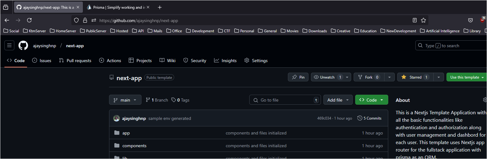
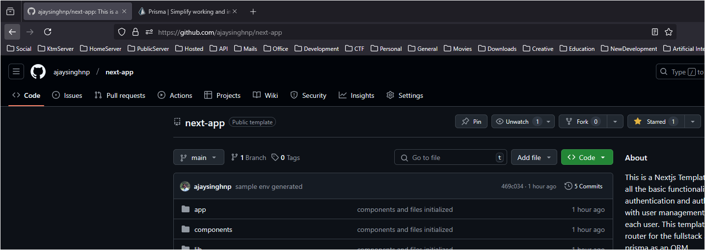
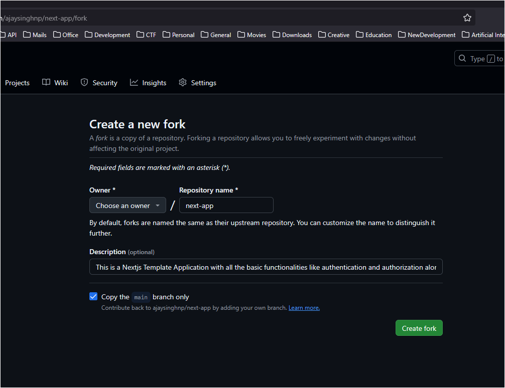

# Contribution or Development Setup

## Step 1. (Optional) Star ⭐ the repo if you like and support this template



### Step 2. Fork the repo to your own repository by clicking on fork



## Step 3. Choose any preferable name if you want to change or continue to keep as it is and click on `Create fork`



This will create your own version of this template in your own github repository.

## Step 4. Clone the repository to your local device

For `https` cloning

```bash
git clone https://github.com/ajaysinghnp/next-app.git
```

for `ssh` cloning

```bash
git clone git@github.com:ajaysinghnp/next-app.git
```

## Step 5. Create a .env file

Project already comes with the required sample env file, but it is just loaded with sample content initially. Change them according to your needs.

## Step 6. Then, run the development server

```bash
npm run dev
# or
yarn dev
# or
pnpm dev
# or
bun dev
```

## Step 7. Open [http://localhost:3000](http://localhost:3000) with your browser to see the result

You can start editing the page by modifying `app/page.tsx`. The page auto-updates as you edit the file.

>[!NOTE]
>This project uses [`next/font`](https://nextjs.org/docs/app/building-your-application/optimizing/fonts) to automatically optimize and load [Geist](https://vercel.com/font), a new font family for Vercel.
