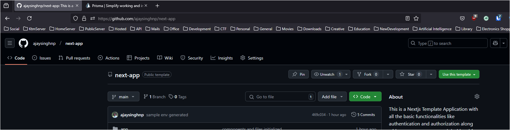

# Getting Started

To use this repo as the starter boilerplate or the base of your own project follow these steps:

## Step 1. Go to the repository on the [GitHub](https://github.com/ajaysinghnp/next-app)

## Step 2. Click on the `Use this template` Button on the right

It will prompt you to create a new repo with the initial data loaded from the current repo.

## Step 3. More steps later
